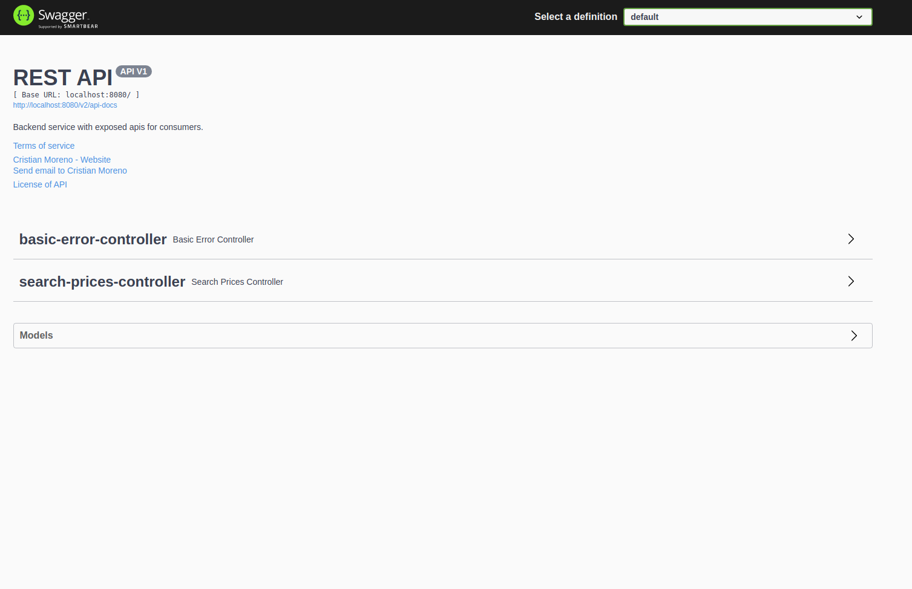

# Getting Started

### Reference Documentation
This service is based in spring-boot. The result exposed way API REST and can be consumed for third party software or for frontend services, that can print result in a single page.

### Run Application
Select BetweenTechnicalProofApplication and Run As java application or spring-boot-app. This will serve a Tomcat Server
in localhost:8080.

### Getting Data travels
There is a servlet controller, that will give you the list of prices for a date, product and brand.
    
### Swagger API Specification
Swagger2 is integrated with this service, allowing check API specification in easy and smart way. For access
please follow the link http://localhost:8080/swagger-ui/.

### Docker deployment
The service is encapsulated in a docker container.

1. Build docker image
    - docker build -t between-service-backend .
2. Run docker image 
    - docker run -p 8080:8080 between-service-backend
